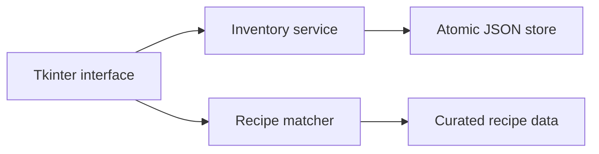

# Genius Kitchen

Genius Kitchen is a Windows desktop application conceived after seeing usable food repeatedly forgotten at home. It tracks ingredient quantities and expiry dates, highlights food that should be used soon and ranks recipes by the ingredients already available.

This repository contains a cleaned and testable version of the original 2021–2023 application. It preserves the product concept and core behaviour in a smaller structure. The historical prototype also included multilingual screens, web-sourced recipes and a resourceful remote update channel; those network integrations are excluded because the original configuration is obsolete and contained private credentials.

## What it demonstrates

- Object-oriented Python and domain modelling
- Persistent local storage with atomic JSON updates
- Date-based expiry calculations
- Recipe matching and ranking
- A functional Tkinter interface
- Separation between interface, storage and application logic
- Unit tests for the core behaviour

## Run locally

```bash
python -m venv .venv
source .venv/bin/activate  # Windows: .venv\Scripts\activate
python -m pip install -e .
python -m genius_kitchen
```

Inventory is stored in `~/.genius-kitchen/inventory.json`. Use `--data-dir` to select another location.

## Test

```bash
python -m unittest discover -s tests
```

## Architecture



## Development history

The first version grew into a large single-file application while I was learning Python. Rebuilding it demonstrates the engineering lessons that followed: isolate domain logic, make dependencies explicit, keep credentials outside source control and test the parts that determine user-visible behaviour.

## Limitations and next steps

- Recipe data is deliberately small and local; a production version would use a licensed recipe API.
- Quantities are tracked but recipe matching currently considers ingredient availability rather than required amounts.
- The interface is optimized for desktop use and has not undergone accessibility testing.

## Recognition

The original project received a Distinction Award and the sole People's Choice Award at the 2021 Coding Lab International Coding Competition.

## Licence

Copyright (c) 2021-2026 Jirapas Wongtreenatrkoon. All rights reserved.

The source is public for portfolio evaluation and educational viewing only. Copying, modification, distribution, sublicensing, sale, commercial use, or creation of derivative works requires prior written permission. See [LICENSE](LICENSE) for the complete terms.
