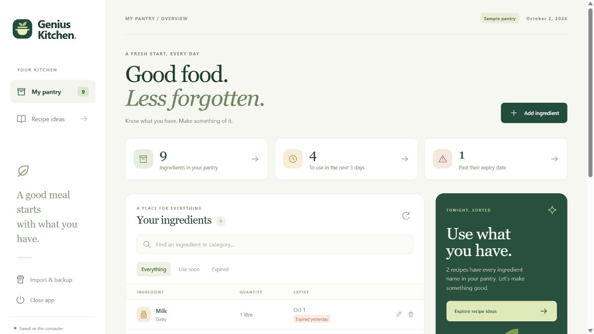
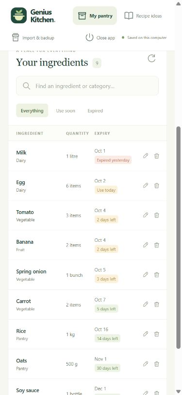
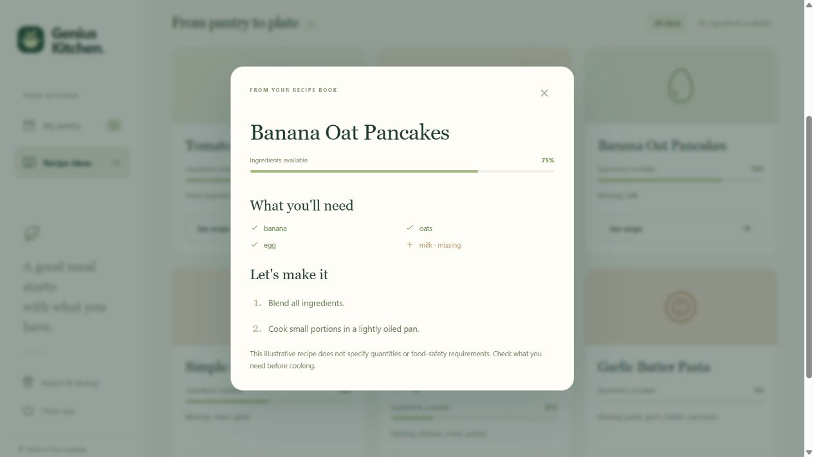
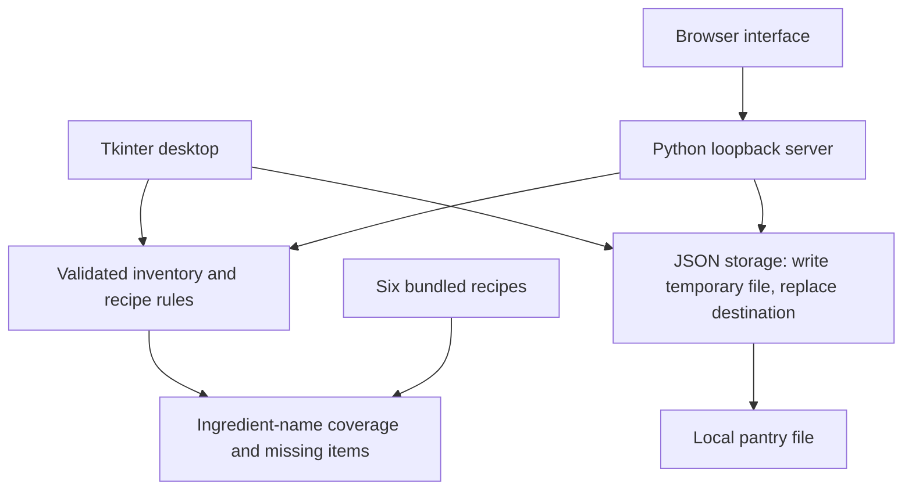
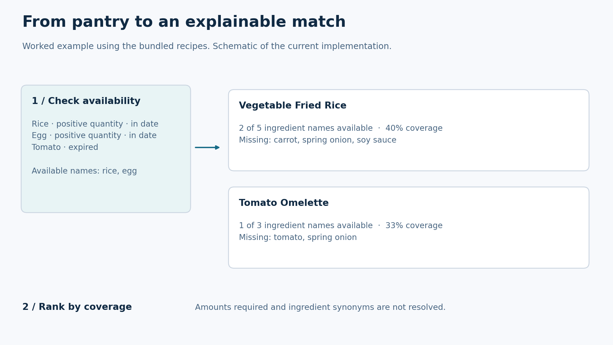

# Genius Kitchen

**Remember what is in the kitchen. Find something to cook.**

Genius Kitchen started with two ordinary problems in my household: ingredients being forgotten until they expired, and evenings when we had food at home but no idea what to cook. I built an application to make those ingredients visible and turn them into meal ideas.

The original application received a **Distinction Award and the sole People's Choice Award** at the **2021 Coding Lab International Coding Competition**.

**[Download the Windows editions](https://github.com/IGoByLotsOfNames/Genius-Kitchen/releases/tag/2026.10.02)** · [Project history](docs/ORIGINAL_PROJECT.md) · [Try the demos](#try-it) · [Engineering](#how-the-current-code-fits-together) · [Checks and measurements](docs/VERIFICATION.md)

## A personal project, developed over time

I developed the original Windows application during 2021–2023 in **Python and Tkinter**, using an object-oriented structure for its screens and application logic. I added expiry tracking, retrieved recipe information with `requests`, and published downloadable builds. To keep updates affordable, the application retrieved version information through a Discord-based channel instead of a paid dedicated server.

In 2026, I returned to Genius Kitchen to develop it further. The existing GitHub implementation became the working base for an **AI-assisted reconstruction and modernisation**. I set the product direction and worked with **Codex, which contributed substantially to implementation, debugging, testing, documentation and packaging**. This phase strengthened the inventory and persistence rules, added reproducible checks, and produced native desktop and local browser editions.

AI helped develop the software. Recipe matching in the application is deterministic: it compares available ingredient names with **six bundled recipes** and explains what is missing. The [project story](docs/ORIGINAL_PROJECT.md) follows the original build and this later collaboration in more detail.

## What it looks like today



*The current browser edition, using an isolated sample pantry. It runs locally on the user's computer.*

<details>
<summary>See the same pantry in a narrow browser window</summary>



*Actual browser capture at 390 × 844. This viewport had no horizontal page overflow.*

</details>

| Everyday task | Native desktop | Local browser |
| --- | --- | --- |
| Keep track of ingredients | Add/remove ingredients, quantities, categories and expiry dates | Add, edit and remove; search and filter by expiry status |
| Find meal ideas | Recipe-name coverage and missing ingredients | Coverage, missing ingredients and recipe instructions |
| Keep data between sessions | Local JSON pantry | Local JSON pantry, export and replacement import |
| Try the project safely | Fresh sample pantry on every demo launch | Fresh sample pantry on every demo launch |

The two editions use separate pantry files. Compatible JSON can be transferred explicitly; changes do not synchronize automatically. The historical application also explored live recipe retrieval, multiple interface languages and remote updates. Those integrations are part of its history; the current editions use local data.

## Try it

For Windows, [download the ZIP bundle](https://github.com/IGoByLotsOfNames/Genius-Kitchen/releases/tag/2026.10.02) for both applications and their demo launchers, or choose either standalone executable. Extract the ZIP before running it. The portable applications include their Python runtimes, so Python installation is unnecessary.

These are the supplied **2 October 2026 builds**, verified without changing their bytes. The release notes and checksums record their provenance.

The source demos require **Python 3.11+**. Run these commands from the repository root:

```sh
# Native desktop: requires Tkinter and a graphical display
python demo.py

# Local browser: starts a local server and opens your browser
python web/server.py --demo
```

Each demo creates a fresh sample session with nine ingredients. It preserves your normal pantry and earlier demo sessions. For browser launch options, including `--no-browser`, see [the browser guide](web/RUN_ME.txt). The native walkthrough is in [DEMO.txt](docs/DEMO.txt).

**A quick experiment:** find Banana Oat Pancakes at 75% coverage, with milk missing. Add fresh Milk with today's expiry date. Coverage becomes 100%; removing that new item brings it back to 75%.



*Banana Oat Pancakes before fresh milk is added: 75% coverage, the missing ingredient and the cooking instructions. Coverage counts ingredient names; it does not evaluate required quantities or dietary suitability.*

The project also includes [native Windows packaging](desktop/RUN_ME.txt) and [browser-edition packaging](web/BUILD.txt), including executable verification scripts. Portable builds bundle their Python runtimes. Build records and [validation notes](docs/VERIFICATION.md) explain the tested environment and remaining checks.

For a regular desktop installation:

```sh
python -m venv .venv
# Activate the environment using your shell's usual command, then:
python -m pip install .
python -m genius_kitchen
```

Normal desktop use saves to `~/.genius-kitchen/inventory.json`; normal browser use saves to `~/.genius-kitchen-web/inventory.json`. Use the browser application's **Close app** button to stop its local server when finished.

## How the current code fits together

The interfaces coordinate the same inventory, validation, persistence and matching rules. Those rules can be exercised independently of the windows or browser.


```mermaid
flowchart TD
    Desktop["Tkinter desktop"] --> Core["Validated inventory and recipe rules"]
    Browser["Browser interface"] --> Server["Python loopback server"]
    Server --> Core
    Core --> Matcher["Ingredient-name coverage and missing items"]
    Recipes["Six bundled recipes"] --> Matcher
    Desktop --> Store["JSON storage: write temporary file, replace destination"]
    Server --> Store
    Store --> Pantry["Local pantry file"]
```

The browser distribution keeps an audited copy of the core for standalone packaging; CI checks that it agrees with the root package.

| Change | Why it matters | Where to look |
| --- | --- | --- |
| Validate records at construction | Invalid dates, malformed fields and non-finite or non-positive quantities are rejected before persistence | [Models](src/genius_kitchen/models.py), [model tests](tests/test_models.py) |
| Save an edit before adopting it in the desktop UI | A failed save must leave the displayed inventory, selection and form consistent with the saved data | [Application](src/genius_kitchen/app.py), [failure tests](tests/test_app.py) |
| Write to a sibling temporary file before replacing JSON | Serialization, write and replacement failures can be injected and checked while preserving the previous file | [Storage](src/genius_kitchen/storage.py), [storage tests](tests/test_storage.py) |
| Track selected rows by object identity | Two ingredients can have equal-looking fields; removing one must remove the chosen occurrence | [Desktop tests](tests/test_app.py) |
| Share one reference date during refresh | Expiry labels and recipe availability stay consistent across midnight and clock changes | [Inventory](src/genius_kitchen/inventory.py), [application tests](tests/test_app.py) |
| Exercise asynchronous browser behavior | Delayed responses, failed requests and stale edits can be tested without relying on request timing | [Frontend tests](web/tests/test_frontend.cjs), [server](web/server.py) |

### An understandable recipe match

The inventory supplies unexpired ingredient names. Matching trims surrounding whitespace, ignores case and returns both the available and missing names. Recipes sort by descending coverage, then fewer missing entries, then name.



*An illustrative matching example. The dates shown are example inputs; the figure is a schematic.*

With P pantry names, R recipes and at most K ingredient entries per recipe, the current scan-and-sort implementation has an upper bound of **O(P + RK + R log R)** under average constant-time set lookup and bounded string lengths. It constructs all matches before returning the requested limit. [The matcher](src/genius_kitchen/recipes.py) remains deliberately straightforward to inspect.

## Checks and measurements

The recorded Windows validation covers several different layers:

| Scope | Recorded result |
| --- | --- |
| Desktop/core suite | **83 tests passed**, including real Tk callbacks, persistence failure paths, expiry boundaries and package resources |
| Browser backend | **26 HTTP/CLI tests passed** |
| Browser frontend logic | **12 async regression tests passed** using Node VM and controlled requests |
| Packaged browser executable | **53 HTTP/resource/shutdown assertions passed** |
| Packaged desktop executable | Real Tk initialization, bundled recipes, Add/Remove and saved-inventory reload passed |

These are separate checks with different scopes. Frontend handler tests do not measure browser rendering; the packaged executable checks exercise the built applications. A fresh browser walkthrough also confirmed the sample's **75% → 100% → 75%** pancake coverage when fresh milk was added and removed. [Validation details](docs/VERIFICATION.md) describe the environment, targeted browser checks and reproduction commands. [GitHub Actions](https://github.com/IGoByLotsOfNames/Genius-Kitchen/actions) records subsequent remote runs.

The retained **2 October 2026 matcher benchmark** provides a reproducible baseline:

| Recipe catalog | Mean ranking time |
| --- | ---: |
| Six bundled recipes | 0.024974 ms |
| 100 synthetic recipes | 0.542641 ms |
| 1,000 synthetic recipes | 6.857010 ms |
| 10,000 synthetic recipes | 92.300083 ms |

These single-machine measurements cover the matching function. Startup, data loading, inventory filtering and interface rendering fall outside the timed interval. The [raw samples and inputs](docs/evidence/2026-10-02/benchmark/results.json) and [benchmark method](docs/BENCHMARKING.txt) make the result inspectable and repeatable.

## What I would work on next

The six illustrative recipes make the basic workflow easy to reproduce. A larger catalog needs clear provenance and better ingredient modelling: aliases, quantity requirements, units and dietary constraints. Expiry labels organize the pantry; food-safety decisions need information this application does not model.

Persistence currently assumes one process per pantry file. The browser handles stale edits between tabs through its server, while cross-process synchronization and recovery need further design. Longer use, keyboard/accessibility checks and execution on a separate clean Windows computer are also useful next steps. Portable builds are unsigned.

The original motivation remains avoiding forgotten ingredients. Household waste reduction and user adoption have not been measured.

## Licence

Copyright © 2021–2026 Jirapas Wongtreenatrkoon. **All rights reserved.** The original project identity and ownership are retained; see [LICENSE](LICENSE). Third-party runtimes and components retain their own terms.
