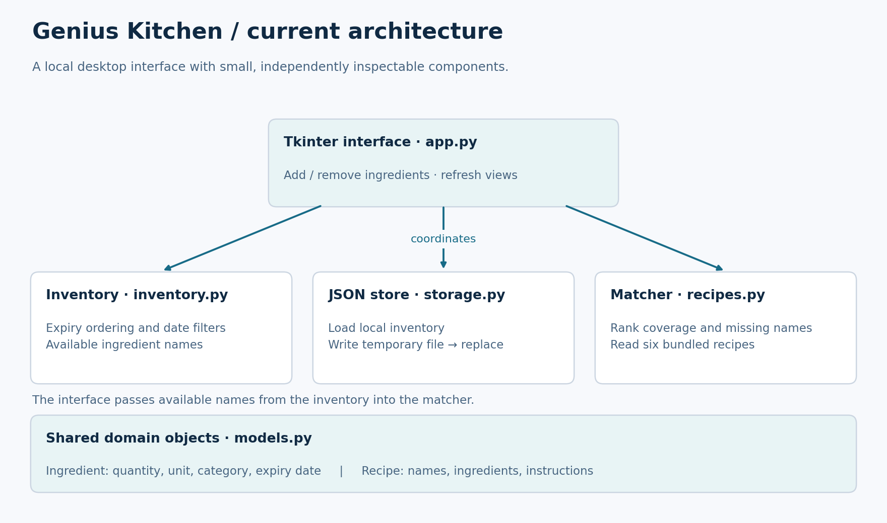

# Genius Kitchen

**Know what you have. Use it before it expires. Find something to cook.**

A Python desktop project born from two everyday problems in my household: forgotten ingredients going to waste, and evenings spent wondering what to cook. I built Genius Kitchen to connect an ingredient inventory, expiry tracking and recipe discovery in one place.

The original application received a **Distinction Award and the sole People's Choice Award** at the **2021 Coding Lab International Coding Competition**.

[Product story](docs/ORIGINAL_PROJECT.md) · [Architecture](#how-the-current-code-fits-together) · [Run locally](#run-locally) · [Tests](#verification)

## From a household problem to a desktop application

I developed the original Windows application during 2021–2023 using **Python, Tkinter and object-oriented programming**. Beyond the inventory itself, I experimented with web-sourced recipe suggestions, multiple interface languages, Windows distribution and a remote update channel that avoided the cost of a dedicated server.

**This repository contains a smaller reconstruction of that application.** It makes the core inventory and recipe-matching logic easier to inspect and test. The original product history and this implementation are described separately in the [project story](docs/ORIGINAL_PROJECT.md).

| Household need | Behaviour in the current application |
| --- | --- |
| Remember what is already in the kitchen | Record an ingredient's name, quantity, unit, category and expiry date |
| Notice food that needs attention | Sort the inventory by expiry; show expired and soon-to-expire items |
| Find ideas from available ingredients | Rank six bundled recipes by ingredient-name coverage and show what is missing |
| Keep the inventory between sessions | Save locally as readable JSON after adding or removing an item |

## How the current code fits together



| Component | Responsibility | Source |
| --- | --- | --- |
| Tkinter interface | Input fields, inventory rows, expiry labels and recipe results | [`app.py`](src/genius_kitchen/app.py) |
| Domain objects | Ingredient dates and values; recipe ingredients and instructions | [`models.py`](src/genius_kitchen/models.py) |
| Inventory | Expiry ordering, date filters and available ingredient names | [`inventory.py`](src/genius_kitchen/inventory.py) |
| Recipe matcher | Available/missing ingredients, coverage and deterministic ordering | [`recipes.py`](src/genius_kitchen/recipes.py) |
| Local persistence | Serialize to a temporary JSON file, then replace the saved inventory | [`storage.py`](src/genius_kitchen/storage.py) |

This structure allows date and matching rules to be tested without opening a window or contacting a recipe service. The current application uses local recipe data and has no third-party Python runtime dependencies; Tkinter support must be available in the Python installation.

## An explainable recipe match


*Illustrative input evaluated against the bundled recipe definitions; this is a schematic, not an application screenshot or measured user outcome.*

1. The inventory supplies ingredient names with positive quantities and expiry dates on or after today.
2. The matcher compares names case-insensitively and reports available and missing ingredients.
3. Recipes are sorted by descending coverage, then fewer missing ingredients, then name. The interface displays up to ten matches.

Coverage is `matched ingredient names / recipe ingredient names`. **A 100% match means every name is present; it does not check whether quantities are sufficient.** Expiry status organises the inventory; it is not a food-safety assessment.

## Run locally

Requires **Python 3.11+** with Tkinter. From a local checkout:

```powershell
# Windows PowerShell: no environment activation required
python -m venv .venv
.\.venv\Scripts\python.exe -m pip install -e .
.\.venv\Scripts\python.exe -m genius_kitchen
```

<details>
<summary>macOS / Linux commands</summary>

```bash
python3 -m venv .venv
.venv/bin/python -m pip install -e .
.venv/bin/python -m genius_kitchen
```

Tkinter may need to be installed separately on some Linux distributions.

</details>

Inventory is stored at `~/.genius-kitchen/inventory.json`. To use a separate inventory or custom recipe file:

```powershell
.\.venv\Scripts\python.exe -m genius_kitchen --data-dir ./demo-data
.\.venv\Scripts\python.exe -m genius_kitchen --recipes ./data/recipes.json
```

The [bundled JSON](src/genius_kitchen/data/recipes.json) shows the recipe schema. Historical Windows builds and this Python package are distinct implementations; these commands run the code in this repository.

## Verification

```powershell
.\.venv\Scripts\python.exe -m unittest discover -s tests -v
```

The five existing unit tests cover selecting expiring items, identifying expired items, excluding expired ingredients from availability, loading packaged recipes and ranking by coverage. See [`tests/`](tests) and the [Python workflow](.github/workflows/python.yml).

The suite is a focused check of core rules, not full GUI, storage-failure or Windows-installer testing. Other current boundaries: the recipe collection is small, synonyms and ingredient quantities are not resolved, and the desktop interface has not undergone formal accessibility testing.

## What I learned

The project started with a problem I could observe directly. Building it taught me how interface state, persistence, dates and external data interact in an application. Distributing Windows builds added another layer: how users receive updates, how configuration travels with a program, and how much complexity lives outside the main feature.

The original application grew into a large module as I learned. The current repository makes the central behaviours easier to follow through explicit domain objects, a small storage component and independently testable matching rules. [Read the development story and design trade-offs →](docs/ORIGINAL_PROJECT.md)

## Licence

Copyright (c) 2021–2026 Jirapas Wongtreenatrkoon. **All rights reserved.**

The source is public for portfolio evaluation and educational viewing. See [LICENSE](LICENSE) for the complete terms, including the limited GitHub display and fork exception.
